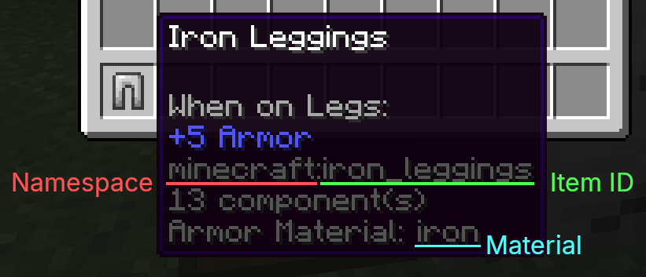
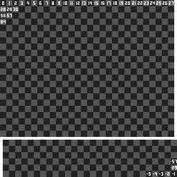

# Creating Armor Chroma-compatible resource packs

## Basics

To edit icons used by Armor Chroma, resource packs should include these files:
- `assets/<namespace>/textures/gui/armor_chroma.json`
- `assets/<namespace>/textures/gui/armor_chroma.png`

The PNG file contains textures, and the JSON file defines where in the PNG each material is located.

To find which icon to use for a given item, the mod uses the following pieces of information:
- Namespace (part before `:` in the full item ID, e.g. "minecraft")
- Item ID (sometimes called "path," part after `:` in the full item ID, e.g. "iron_leggings")
- Material (if you are a modder, see the mod's `MaterialHelper` class)

These can be found in the item tooltip when advanced tooltips are enabled (F3 + H).



The mod looks for icons in this order:
1. Look for `<material>` in the `materials` property of `assets/<namespace>/textures/gui/armor_chroma.json`
2. Look for a wildcard pattern matching `<material>` in the `materials` property of `assets/<namespace>/textures/gui/armor_chroma.json`
3. Look for `<item ID>` in the `items` property of `assets/<namespace>/textures/gui/armor_chroma.json`
4. Look for a wildcard pattern matching `<item ID>` in the `items` property of `assets/<namespace>/textures/gui/armor_chroma.json`
5. Look for `default` in the `special` property of `assets/<namespace>/textures/gui/armor_chroma.json`
6. Look for `default` in the `special` property of `assets/minecraft/textures/gui/armor_chroma.json`

For examples, see [the mod's assets](../src/main/resources/assets) and [the built-in resource pack](../src/main/resources/resourcepacks/alternative-icons).

## armor_chroma.png

For 16x16 resource packs, `armor_chroma.png` files should be 256x256 textures where each icon is 9x9.

Icons should be aligned on a 9x9 grid starting from either the top left corner or the bottom right corner.

Each icon is assigned a number based on its position.
The icon in the top left corner is icon 0, the one next to it is icon 1, and so on.
Each line contains up to 28 icons so icon 28 is the one under icon 0, icon 56 is the one under icon 28, and so on.

Icons in the bottom right corner are numbered using negative numbers in a similar fashion.



## armor_chroma.json

`armor_chroma.json` files should look like this:
```json
{
    "materials": {
        "examplium": 0,
        "examplite": 1,
        "gilded_exemplite": 2
    },
    "items": {
        "example_shield": 3,
        "*_helmet": 4
    },
    "special": {
        "default": 0,
        "leadingMask": -1,
        "trailingMask": -2
    }
}
```

(A basic JSON schema is available [here](armor_chroma.schema.json).)

If this file is placed in `assets/example/textures/gui/`, it will only affect items in the `example` namespace (i.e. with IDs starting with `example:`).
It would do the following:
- Make items with material `examplium` use icon 0 in `assets/example/textures/gui/armor_chroma.png`
- Make items with material `examplite` use icon 1
- Make items with material `gilded_exemplite` use icon 2
- Make the item `example:example_shield` use icon 3
- Make items `example:*_helmet` use icon 4
- Make all other items in the `example` namespace use icon 0

Keys in the `materials` and `items` objects behave as explained in the previous section.

Keys can include patterns with wildcards (`*`).
They will be used for any material/item whose name/ID matches the pattern.

The `special` object has three possible keys:
- `default`, as explained previously
- `leadingMask` and `trailingMask` which point to the icons to use as masks for partial armor icons

Values should be integers representing the position of the icon in the corresponding `armor_chroma.png` file.
The same icon can be used by multiple materials or items, for instance icon 0 is used twice in the previous example.

`materials`/`items`/`special` do not need to be specified if they are empty, and keys in `special` should only be specified if you intend to replace the base icon.
For instance, this:
```json
{
    "materials": {
        "examplium": 0,
        "examplite": 1,
        "gilded_exemplite": 2
    },
    "items": {},
    "special": {}
}
```
can be simplified to:
```json
{
    "materials": {
        "examplium": 0,
        "examplite": 1,
        "gilded_exemplite": 2
    }
}
```
